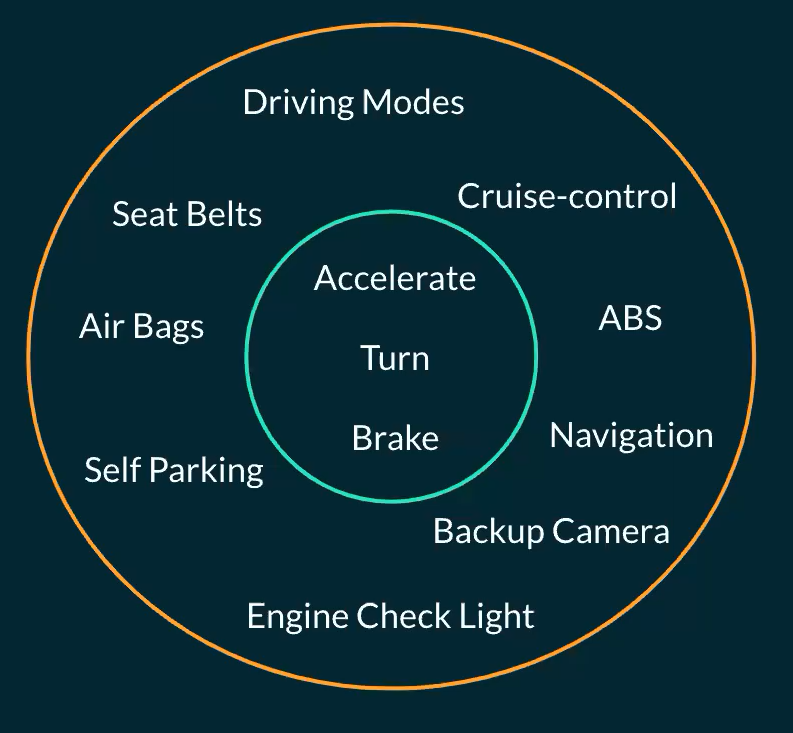
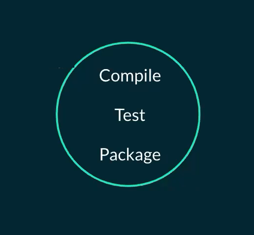
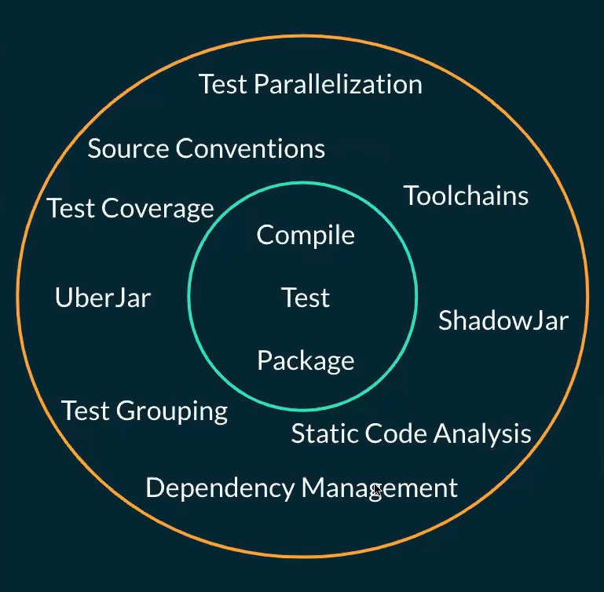

# Jvm Builds

## Evolution of Build Tools

As with everything, build tools evolve over time. if we consider a car at the beginning, it only has Accelerate, Turn and Brake which are basic things a car needs. But overtime more things are are added to the cars like Seat Belts, Self Parking, etc.

As you can see in the following image, at the beginning build tools only consisted of basic features which are a way to compile the app, run application tests and package the app.

<figure markdown>

  { width="300" }

</figure>

and as time passed more features were added to build systems Dependency Management, Static code analysis and Test Grouping.

They are evolving continuously to Help us create code better and they do a lot of heavy lifting behind the scenes like dependency management.
