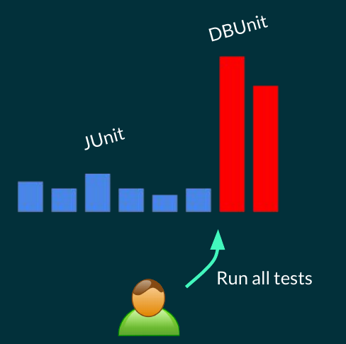
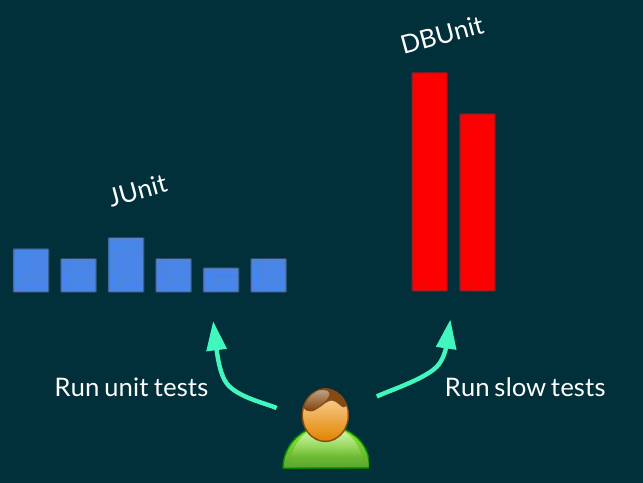

# Jvm Builds

## Evolution of Build Tools

As with everything, build tools evolve over time. if we consider a car at the beginning, it only has Accelerate, Turn and Brake which are basic things a car needs. But overtime more things are are added to the cars like Seat Belts, Self Parking, etc.


As you can see in the following image, at the beginning build tools only consisted of basic features which are a way to compile the app, run application tests and package the app.


<figure markdown>

  { width="300" }

</figure>

and as time passed more features were added to build systems Dependency Management, Static code analysis and Test Grouping.


They are evolving continuously to Help us create code better and they do a lot of heavy lifting behind the scenes like dependency management.

## Gradle JVM Plugins

As you (should) know gradle by itself provide minimal configuration and most thing are added to it by applying plugins. The same goes for java and other jvm languages kotlin, groovy and scala.

In this section we check common used plugins in jvm builds for java, kotlin, groovy and scala languages.

### **Java** Plugins

For **java** there are 3 main plugins when it comes to java: `java` plugin, `java-library` plugin and `application` plugin

- **`java`** plugin

    This plugin is the base java plugin which provides **source code locations** for java which are called SourceSets.
    
    -   `src/main/java`
    -   `src/test/java`

    adds tasks like **compileJava** and **test** for compiling the source codes and running tests respectively  

- **`java-library`** plugin

    This plugins applies the java plugin automatically which means by applying it we will have everything the java plugin has.
    
    Add **api** dependency configuration which will talk more about it later.

- **`application`** plugin

    This plugins applies the java plugin automatically which means by applying it we will have everything the java plugin has.

    Adds build configuration to determine _main_ class

    Adds **run** and **package** tasks to run the application (via the main class provided) and package the app respectively

### **kotlin** plugin

It is `org.jetbrains.kotlin.jvm` plugin which is maintained by jetbrains.

This plugins applies the java plugin automatically which means by applying it we will have everything the java plugin has.

Adds sourceSets for **kotlin** code which can be used along side normal java sourceSets:

- `src/main/kotlin`
- `src/test/kotlin`

!!! warning ""

    Never put `java` files inside kotlin sourceSets. they will not be compiled. put them in the appropriate java sourceSet (`src/main/java` or `src/test/java`)

Adds **CompileKotlin** task to compile kotlin code.

`java-library` and `application` plugins can be applied along side this plugin to add more functionality.
    
### **groovy** plugin

This plugin extends the `java` plugin.

Adds sourceSets for **kotlin** code which can be used along side normal java sourceSets:

- `src/main/groovy`
- `src/test/groovy`

Adds **CompileGroovy** task to compile groovy code.

Can be used along side java.

`java-library` and `application` plugins can be applied along side this plugin to add more functionality.

### **scala** plugin

This plugin extends the `java` plugin.

Adds sourceSets for **kotlin** code which can be used along side normal java sourceSets:

- `src/main/scala`
- `src/test/scala`

Adds **CompileScala** task to compile scala code.

Can be used along side java.

`java-library` and `application` plugins can be applied along side this plugin to add more functionality.

## Source Organization

`SourceSets` are configurations which are provided by the plugins in order to **logically group** sources. Basically they tell gradle where our source codes are.

By default there are 2 **sourceSets**: `main` and `test`. It is possible to change the default location of source files (check [here](https://kotlinlang.org/docs/gradle-configure-project.html#kotlin-and-java-sources-for-javascript)) but it is recommended to use the default ones.

### How are sourceSets useful?

In order to answer these question we check these two scenarios:

- Handle Generated Source Codes
- Running Expensive Tests

#### Handling Generated Source Codes

Some tasks in our projects generate code dynamically (like annotation processors). It is recommended not to push these codes in source control and put them under `build/generated`. 

??? info "Why shouldn't we add generated sources to source control?"

    - **Redundency & Size**: Generally size of generated sources is large and is easily reproducable. This means the Repository size is increased unnecessarily.

    - **Merge conflicts**: These files, especially if they change frequently, can lead to an increased number of merge conflicts in version control systems. This can happen when different developers generate slightly different versions of these files on their local machines.

    - **Reproducibility**: If generated files are included in version control, there's a risk that builds on different machines might rely on slightly different versions of these files, leading to inconsistencies.

    - **Maintainabiliy**: By not tracking these files in version control, you ensure that your repository only contains the essential source files that developers need to work with. This makes the repository cleaner and more maintainable.

For This Reason we put the generated source under `build/generated/sources` directoru and add it as a sourceSet to gradle so it automatically looks in those folder for sources.

In order to add a location to a sourceSet we do the following:

```kotlin
sourceSets {
    main {
        java {
            srcDir("<path>")
        }
    }
}
```

This path is static and if the task which generates the code, changes it then we must change it here as well (also we need to remember to execute that task before the compile, so sources are generated) but we can use **inferred task dependency**  to avoid that: 

```kotlin
sourceSets {
    main {
        java {
            srcDir(tasks.named("someTask"))
        }
    }
}
```

Now by doing this, we automatically use the correct location if it is changed, also **someTask** task is automatically executed before the compile task so source generation is done.

In the following example we copy sources from a folder to the build folder (we assume these sources are generated with ai):

```kotlin
tasks.register<Copy>("generateMlCode") {
    from(rootProject.layout.projectDirectory.dir("mlCodeGenTemplate"))
    into(layout.buildDirectory.dir("generated/sources/mlCode"))
}

sourceSets {
    main {
        java {
            srcDir(tasks.named("generateMlCode"))
            // Note: DO NOT do the following
            srcDir(layout.buildDirectory.dir("generated/sources/mlCode"))
        }
    }
}
```

#### Running Expensive Tests

Unit tests must execute fast, becuase developers run them frequently after small changes to verify the tests. Now if running these tests takes alot of time, developers might not run them as often. (Slow tests are database tests or tests with network requests, etc)

<figure markdown>

{ width="300" }

</figure>

By defining a separate **sourceSet** for expensive tests allows us to run fast tests separatelt from them and run expensive tests when needed.

<figure markdown>

{ width="300" }

</figure>

!!! Note "Junit Tags"

    If junit is the test framework, we can use test *tags* to run parts of tests not all of them. but not all test framework provide this feature.

Using separate sourceSet has another benefit: Expensive tests require different dependencies which we can only add to their sourceSet alone and fast tests do not have those dependencies

!!! Note "Android Framework tests"

    In android for tests related to android framework which needs an android emulator to execute, they have defined a separate sourceSets called **androidTest**.

### SouceSets: More than Just Sources

Beside Source Locations, there are more information within a sourceSet:

- Dependencies
- Classpath for compilation and runtime
- Input classes: Where are our sources?
- Impl configuration: What configuration to use to add a dependency to it.
- Output classes: Where are java class bytecodes

Using the following code, you can findout about these informations:

```kotlin linenums="1" hl_lines="26 31 36 39 42 52"
import java.nio.file.Paths

tasks.register("sourceSetsInfo") {
    doLast {
        fun isInGradleDirectory(file: File): Boolean {
            var parent: File? = file.parentFile
            while (parent != null) {
                if(parent.name == ".gradle") {
                    return true
                }
                parent = parent.parentFile
            }

            return false
        }

        val projectPath = layout.projectDirectory.asFile.toPath()
        val gradleHomePath = gradle.gradleUserHomeDir.toPath()
        val cachePath = Paths.get(gradleHomePath.toString(), "caches/modules-2/files-2.1/")

        sourceSets.forEach { sourceSet ->
            println()
            println("[${sourceSet.name}]")

            println("\tsrcDirs:")
            sourceSet.allSource.srcDirs.forEach { dir ->
                println("\t\t${projectPath.relativize(dir.toPath())}")
            }

            println("\tsrcDirs:")
            sourceSet.output.classesDirs.files.forEach { file ->
                println("\t\t${projectPath.relativize(file.toPath())}")
            }

            println("\timpl dependency configuration:")
            println("\t\t${sourceSet.implementationConfigurationName}")

            println("\tCompile Task:")
            println("\t\t${sourceSet.compileJavaTaskName}")

            println("\tCompile Classpath:")
            sourceSet.compileClasspath.files.forEach { file ->
                if(isInGradleDirectory(file)) {
                    println("\t\t${cachePath.relativize(file.toPath())}")
                } else {
                    println("\t\t${projectPath.relativize(file.toPath())}")

                }
            }

            println("\tRuntime Classpath:")
            sourceSet.runtimeClasspath.files.forEach { file ->
                if(isInGradleDirectory(file)) {
                    println("\t\t${cachePath.relativize(file.toPath())}")
                } else {
                    println("\t\t${projectPath.relativize(file.toPath())}")

                }
            }

        }
    }
}
```

!!! Note ""

    Note: Android SourceSets have slightly different API